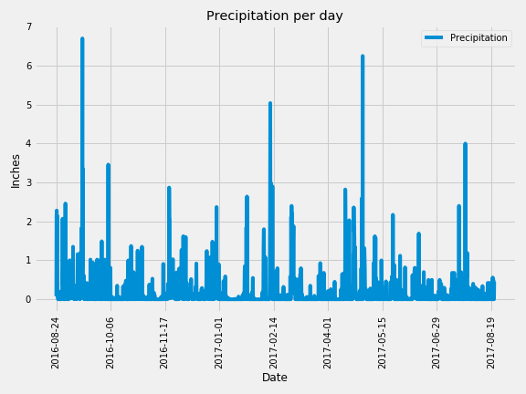
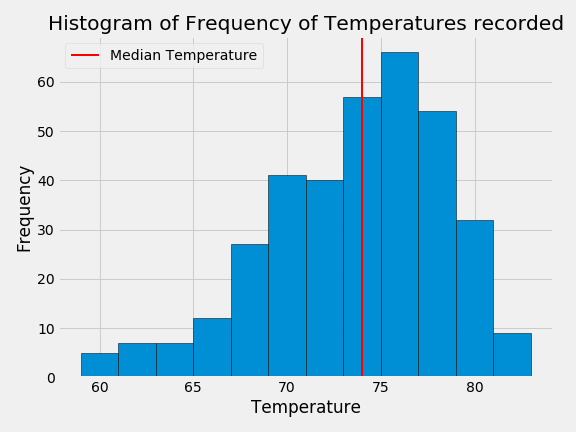
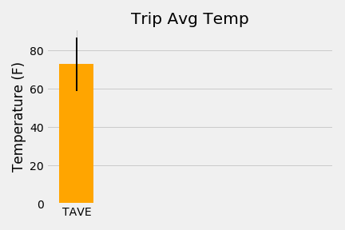

## sqlalchemy-challenge

### Please note:

1) All weather analysis (Precipitation and Weather) can be found in the climate_starter.ipynb jupyter notebook, here:[climate_starter](climate_starter.ipynb)

2) All API SQllite Connection& Landing Page, Static Routes, and Dynamic routes can be found here:
[app.py](app.py)

3) All plots generated are in the jupyter notebook, and also saved to the plots folder and linked below.

 

4) This plot was part of the bonus work for average trip temperature:
   

