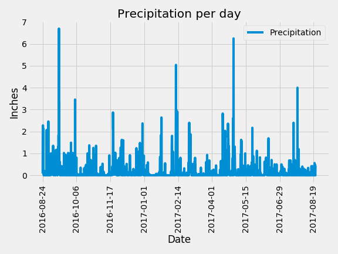
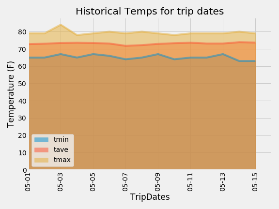

## Surfs Up sqlalchemy-challenge

### Please note:

#### Section 1

1) All weather analysis (Precipitation and Weather) can be found in the climate_starter.ipynb jupyter notebook, here:[climate_starter](climate_starter.ipynb)

2) All API SQllite Connection& Landing Page, Static Routes, and Dynamic routes can be found here:
[app.py](app.py)

3) All plots generated are in the jupyter notebook, and also saved to the plots folder and linked below.

 

#### Section 2
(Bonus work: Rubric column 1)

4) The following two plots were completed as part of the bonus work trip temperatures and normal trip temperaures:
   

